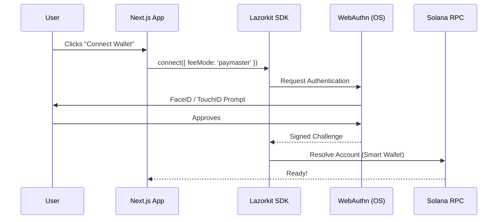

# Tutorial 1: 10x Solana UX with Passkeys & Lazorkit

In this tutorial, we will dive deep into how to implement **biometric authentication (Passkeys)** on Solana using the Lazorkit SDK. This approach eliminates the friction of seed phrases and browser extensions, moving closer to the goal of "10x Solana UX".

## 1. The Vision: Why Passkeys?

Traditional Web3 onboarding requires users to:

1. Download a wallet app or extension.
2. Securely store a 12-24 word seed phrase.
3. Manually approve every transaction pop-up.

**With Lazorkit and Passkeys**, the flow becomes:

1. Click "Connect".
2. Verify with FaceID/TouchID/Windows Hello.
3. Done.

### 🧬 Architectural Overview



---

## 2. Setting Up the Environment

First, ensure you have the necessary dependencies installed:

```bash
npm install @lazorkit/wallet @lazorkit/sdk @solana/web3.js
```

In your Next.js project, you should set up a configuration file (e.g., `lib/config.ts`):

```typescript
export const LAZORKIT_CONFIG = {
  NETWORK: "devnet",
  RPC_URL: "https://api.devnet.solana.com",
  // You can also add your Paymaster URL here
};
```

---

## 3. Implementing the Connection Flow

The core of the integration lies in the `ConnectButton`. In Lazorkit, the `useWallet` hook manages the authentication lifecycle.

### The `connect` Function

When calling `connect()`, Lazorkit triggers the browser's WebAuthn API.

```typescript
import { useWallet } from "@lazorkit/wallet";

export function ConnectButton() {
  const { connect, disconnect, isConnected, isConnecting, wallet } =
    useWallet();

  const handleConnect = async () => {
    try {
      // feeMode: 'paymaster' tells Lazorkit to prepare for gasless transactions
      await connect({ feeMode: "paymaster" });
    } catch (err) {
      console.error("Mastering Passkey Auth failed:", err);
    }
  };

  // ... UI Rendering
}
```

### 💡 Pro Tip: Transaction Fee Modes

Lazorkit supports two primary fee modes:

- `user`: User pays fees in SOL (traditional).
- `paymaster`: Fees are covered by a sponsor (gasless).

---

## 4. Account Abstraction & Smart Wallets

Lazorkit doesn't just create a simple 'keypair'. It initializes a **Smart Wallet** (Account Abstraction) that is controlled by your Passkey.

| Feature      | Passkey Wallet                   | Traditional Keypair               |
| :----------- | :------------------------------- | :-------------------------------- |
| **Recovery** | Device Sync (iCloud/Google)      | Manual Seed Phrase                |
| **Gasless**  | Native Support                   | Requires Complex Relayers         |
| **Security** | Hardware-backed (Secure Enclave) | Software-backed (Browser Storage) |

When a user connects, `wallet.smartWallet` provides the public key of this abstracted account.

---

## 5. UI Best Practices for Biometrics

Since Passkey authentication involves a native OS prompt, it's crucial to provide visual feedback to the user:

1. **State Indicators**: Show an "Authenticating..." state while the OS modal is open.
2. **Glassmorphism Design**: Use high-quality UI elements to convey "Premium Security".
3. **Error Handling**: Common errors include `User cancelled` or `Security limitation`. Handle them gracefully with user-friendly messages.

```tsx
{
  isConnecting && (
    <div className="authentication-overlay">
      <Spinner />
      <p>Waiting for biometric authentication on your device...</p>
    </div>
  );
}
```

---

## 6. Next Steps

Once the user is connected via Passkey, they are ready to transact. However, they might not have SOL in their new wallet. This is where **Gasless Transfers** come in.

Check out [**Tutorial 2: Gasless Transfers**](./TUTORIAL-2-GASLESS-TRANSFER.md) to complete the loop!

---

Built by [Lazorkit Integration Team].
