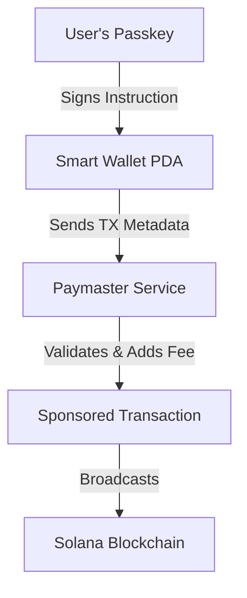

# Tutorial 2: Mastering Gasless Transfers with Lazorkit

Gasless (or sponsored) transactions are a game-changer for Solana onboarding. They allow developers to pay for user transaction fees, removing the "Need SOL to start" barrier.

This guide covers the implementation theory and practical code for triggering gasless transfers using Lazorkit.

---

## 1. The Mechanics of Sponsorship

In a standard transaction, the sender pays the fee. In a sponsored transaction, the Lazorkit Paymaster signs the transaction as the "Fee Payer".

### 🔄 The Smart Wallet Workflow



The user's account is actually a Program Derived Address (PDA), allowing it to benefit from program-side logic like sponsorship.

---

## 2. Implementation: The `signAndSendTransaction` Hook

Lazorkit provides a high-level hook to handle the complexities of sponsorship automatically.

### Basic SOL Transfer

```typescript
import { SystemProgram, LAMPORTS_PER_SOL, PublicKey } from "@solana/web3.js";
import { useWallet } from "@lazorkit/wallet";

export function TransferComponent() {
  const { signAndSendTransaction, wallet } = useWallet();

  const handleTransfer = async (recipient: string, amount: number) => {
    // 1. Create the standard instruction
    const instruction = SystemProgram.transfer({
      fromPubkey: new PublicKey(wallet.smartWallet),
      toPubkey: new PublicKey(recipient),
      lamports: amount * LAMPORTS_PER_SOL,
    });

    // 2. Wrap in a sponsored call
    const signature = await signAndSendTransaction({
      instructions: [instruction],
      transactionOptions: {
        feeToken: "USDC", // Optional: Paymaster can collect fees in tokens
        computeUnitLimit: 200000,
        clusterSimulation: "devnet",
      },
    });

    console.log("Success! TX Signature:", signature);
  };
}
```

---

## 3. Deep Dive into `transactionOptions`

To ensure a smooth gasless experience, you must configure the options correctly:

- **`feeToken`**: Even if the transaction is "gasless" for the user, it might be "token-based" gas (e.g., user pays in USDC instead of SOL). If the Paymaster is 100% sponsoring, this behaves as the internal accounting token.
- **`computeUnitLimit`**: Essential for complex transactions to prevent "Out of Compute" errors.
- **`clusterSimulation`**: Always ensure your simulation matches the intended network to avoid "Account Not Found" errors.

---

## 4. Handling Success & Failure

Gasless transactions can still fail due to blockchain congestion or insufficient Paymaster funds. Always provide an "Audit Trail" (Transaction History).

### 📝 Example Transaction History Logic

```typescript
const [history, setHistory] = useState<any[]>([]);

const executeTx = async () => {
  try {
    const sig = await signAndSendTransaction({...});
    setHistory([{ signature: sig, status: 'pending', time: Date.now() }, ...history]);

    // Periodically check status
    confirmSignature(sig);
  } catch (error) {
    showToast("Simulation failed: " + error.message);
  }
};
```

---

## 5. Security Model

- **Authorized Instructions Only**: The Paymaster only sponsors instructions that originate from the user's Smart Wallet PDA.
- **Rate Limiting**: Most Paymaster services implement rate limiting to prevent drainage.
- **Biometric Guard**: Every gasless transaction still requires a Passkey signature from the user—the Paymaster only adds the fee signature.

---

## 6. Conclusion: A New Standard

By combining Passkeys (Auth) and Paymasters (Fees), you create a frictionless experience where:

1. User enters site.
2. User provides biometric ID.
3. User performs on-chain action.
4. User leaves happy.

This is the standard for modern Solana dApps. For a full code reference, see `src/components/GaslessTransfer.tsx` in the example repository.

---

Part of the [Lazorkit Integration Series].
